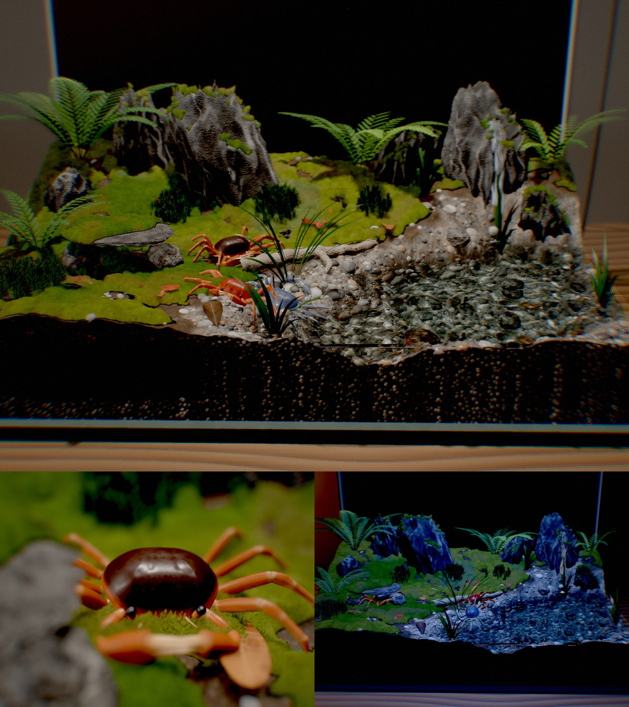

# サワガニ水槽

3匹のサワガニ（*Geothelphusa dehaani*）が暮らす渓流のアクアテラリウムを、ブラウザでリアルタイムに描く 3D 水槽です。
画像や 3D モデルのファイルは一切使わず、地形・岩・苔・シダ・水・カニの体まで、すべて [Three.js](https://threejs.org/) のコードから生成しています。

**▶ デモ: https://tanuu5.github.io/sawagani-aquaterrarium/**



## Claude Opus 5.5（MAX）で制作

このリポジトリのコードと README は、[Claude Code](https://claude.com/claude-code) 上の **Claude Opus 5.5（推論の深さ: MAX）** が書きました。
依頼は「テラリウム的な感じで、サワガニを飼育している水槽を作って欲しい。Three.js 等を駆使して、可能な限り高品質かつ、リアルに」という一文だけで、設計・造形・動き・画作りは Claude が担当しています。人は完成品を見てフィードバックを返しました（例: 隠れ家の平石が浮いてカニが挟まる → 支え石の高さを自動で合わせる形に修正）。

制作の流れはおおよそ次のとおりです。

1. 参考写真でサワガニの形と色を確認し、甲羅・脚・はさみの寸法を決める
2. 描画パイプライン（2 パス描画、屈折、被写界深度、ブルーム、トーンマップ）を組む
3. 地形・岩・苔・植物・水を順に作り、ブラウザで撮影しては直す
4. カニを SDF で造形し、骨格・IK・歩行・行動を実装する
5. 操作 UI、昼夜、音、読み込みの高速化（Web Worker）、描画負荷の調整

## 見どころ

- **サワガニ 3 匹**: チャコ（茶系・オス）、ベニ（赤系・メス）、アオ（青系・オス）
  - 甲羅の輪郭と H 字の溝、眼柄、第 3 顎脚、触角、7 節の歩脚、歯のあるはさみ（オスは片方が大きい）を SDF で造形
  - 4 本ずつ交互に踏み出す横歩きを IK で再現。地形に合わせて体を傾け、石の下ではかがむ
  - 散歩・採餌・石の下に隠れる・水浴び・口元で泡を吹く・仲間への威嚇・驚いて逃げる
- **水槽**: 青龍石風の岩と苔、シダ、セキショウ、スギゴケ、落ち葉、流木、石組みの隠れ家、岩を伝う滝
- **水**: 波紋の GPU シミュレーション、画面空間の屈折、水底で揺れるコースティクス、水中の吸収と散乱、ガラス上部の結露
- **画作り**: 自動フォーカスの被写界深度、ブルーム、AgX トーンマップ。描画解像度はフレーム時間を見て自動調整

## 操作

| 操作 | 内容 |
| --- | --- |
| ドラッグ / ホイール（ピンチ） | 視点の回転・ズーム |
| カニ・名札をクリック | そのカニを追いかける |
| えさ（F） | 水槽の中をクリックした場所に餌を落とす。匂いに気づいたカニが食べに来る |
| トントン（T） | ガラスをたたく。驚いて逃げたり、はさみを振り上げて威嚇したりする |
| 昼 / 夜（N） | LED 照明と月光 LED の切り替え。夜はよく歩き回る |
| カメラ（C） | 自由視点 → 追いかける → 自動 |
| 水音 | 滝の水音を WebAudio で合成して再生 |

45 秒操作がないと自動カメラに切り替わります。WebGL2 に対応したブラウザ（最新の Chrome・Edge・Safari・Firefox）で動きます。

## ローカルで動かす

ES Modules を使うので、簡易サーバー経由で開きます（ビルドは不要です）。

```bash
python3 tools/serve.py 8765
```

ブラウザで http://localhost:8765 を開きます。`?crab` を付けるとカニ単体を確認するビューアになります。

## 構成

```
index.html          UI（HTML/CSS）と import map
src/main.js         読み込みの流れと毎フレームの更新
src/core/           描画パイプライン、シェーダーの共通部品、ノイズ、乱数
src/world/          部屋・水槽・地形・岩・苔・植物・水・滝・餌と泡・経路探索
src/crab/           サワガニ（造形・骨格・歩行・行動）
src/ui/             操作パネル、カメラ、昼夜、水音
tools/serve.py      開発用サーバー
```

- `src/crab/crabShapes.js`: SDF による甲羅・脚・はさみの造形と Surface Nets によるメッシュ化。Web Worker（`crabWorker.js`）で他の生成と並行して実行
- `src/crab/crabRig.js`: 約 60 本の骨で全パーツを 1 つのスキンメッシュにまとめ、脚の IK と体色（赤系・茶系・青系）のシェーダーを持つ
- `src/crab/crab.js`: 歩行（2 組の脚の交互ステップ）、体の姿勢、行動の状態遷移
- `src/world/nav.js`: 上から焼いた高さマップ・天井マップと A* による経路探索
- `src/core/post.js`: MSAA の 2 パス描画（不透明 → 水面・ガラス）、屈折用コピー、被写界深度、ブルーム、仕上げ

## ライセンス

[MIT License](LICENSE) です。自由に改変・再配布できます。

## クレジット

- [three.js](https://github.com/mrdoob/three.js)（MIT License）を jsDelivr から読み込んでいます
- フォント: [Shippori Mincho B1](https://fonts.google.com/specimen/Shippori+Mincho+B1)、[Zen Kaku Gothic New](https://fonts.google.com/specimen/Zen+Kaku+Gothic+New)（SIL Open Font License、Google Fonts）
- サワガニの形と色は、Wikimedia Commons の [Geothelphusa dehaani](https://commons.wikimedia.org/wiki/Category:Geothelphusa_dehaani) の写真を参考にしました（画像そのものは使っていません）
